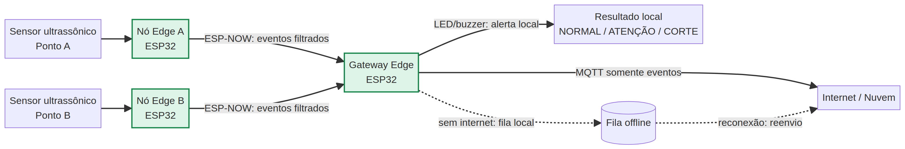

# Sprint 03 — Edge Computing

## Sistema Edge Integrado para Monitoramento de Vegetação

> PoC acadêmica da disciplina de **Edge Computing** para demonstrar monitoramento distribuído, processamento local e operação resiliente em uma rodovia.

[](https://www.python.org/)
[](https://www.espressif.com/)
[](https://www.espressif.com/)
[](https://github.com/)

## Visão geral

Esta solução representa pontos de monitoramento instalados ao longo de uma rodovia. Cada ponto possui um sensor ultrassônico conectado a um ESP32. Os nós sensores tratam os dados e classificam a altura da vegetação localmente. Um terceiro ESP32 funciona como gateway, recebe apenas eventos relevantes por ESP-NOW, aciona um alerta local e encaminha informações por MQTT quando existe conectividade.

O princípio central é **processar primeiro e transmitir depois**. A nuvem não é necessária para a função principal: medir, classificar e alertar continuam funcionando mesmo quando a internet está indisponível.

## Arquitetura



| Componente | Responsabilidade | Tecnologia |
|---|---|---|
| Nó sensor A | Medir, filtrar, calcular média e classificar | ESP32 + HC-SR04 |
| Nó sensor B | Monitorar um segundo ponto independente | ESP32 + HC-SR04 |
| Gateway Edge | Receber eventos, acionar LED e manter fila offline | ESP32 + ESP-NOW |
| Integração externa | Receber eventos quando houver internet | Wi-Fi + MQTT |

O diagrama editável está em [`diagrams/arquitetura.mmd`](diagrams/arquitetura.mmd).

## Regras de decisão no Edge

Cada nó realiza cinco medições por ciclo. Valores negativos, timeouts e valores acima de 80 cm são tratados como inválidos. A média das leituras válidas é classificada conforme a tabela:

| Altura média | Estado | Ação |
|---:|---|---|
| Menor que 25 cm | `NORMAL` | Continua monitorando sem transmitir repetidamente |
| De 25 cm até abaixo de 30 cm | `ATENCAO` | Envia evento ao gateway |
| A partir de 30 cm | `CORTE_NECESSARIO` | Envia alerta e aciona o LED do gateway |
| Nenhuma leitura válida | `FALHA_SENSOR` | Reporta falha para diagnóstico |

Essa decisão ocorre no dispositivo próximo ao sensor para reduzir latência, consumo de energia e tráfego de rede. O payload transmitido contém o nó, a média, o estado e a quantidade de leituras válidas, em vez de enviar todas as amostras brutas.

## Estratégia de comunicação e falhas

A comunicação entre os ESP32 usa **ESP-NOW**, pois é direta, leve e não depende de um roteador para a comunicação local. O gateway usa MQTT apenas para integração externa. Em caso de perda de internet, os sensores continuam medindo e o gateway continua acionando o alerta local. Os eventos externos são armazenados em uma fila offline de demonstração e ficam disponíveis para reenvio após a reconexão.

Na versão de campo, a fila em RAM deve ser substituída por armazenamento persistente, como NVS/Preferences ou cartão SD, para preservar eventos após reinicializações.

## Como executar a demonstração local

A lógica de negócio possui uma implementação Python independente do hardware. Ela permite validar a decisão Edge e apresentar os cenários antes da montagem física.

```bash
cd /home/ubuntu/vegetacao-edge-sprint03
python3 -m unittest discover -s tests -v
PYTHONPATH=src python3 src/simulate.py
```

A suíte automatizada valida classificação, filtragem, média, mudança de estado e falha de sensor. O simulador demonstra vegetação normal, atenção, corte necessário e perda de conectividade.

## Montagem no Wokwi ou em hardware

Utilize três placas ESP32. Carregue [`firmware/sensor_node.ino`](firmware/sensor_node.ino) em dois dispositivos, alterando `NODE_ID` para `PONTO_A` e `PONTO_B`. Conecte um HC-SR04 em cada nó usando `TRIG` no GPIO 5 e `ECHO` no GPIO 18. Carregue [`firmware/gateway.ino`](firmware/gateway.ino) no terceiro dispositivo e conecte o LED de alerta ao GPIO 2.

Antes de executar os nós, substitua `gatewayMac` pelo endereço MAC real do gateway. Para integração MQTT, configure o SSID, a senha e o broker no gateway. Em uma apresentação acadêmica, o monitor serial deve ser usado para mostrar as decisões locais e a fila durante a falha de internet.

## Cenários de apresentação

| Cenário | Entrada simulada | Evidência esperada |
|---|---|---|
| Normal | 18–21 cm | Monitoramento continua sem transmissões repetitivas |
| Atenção | 26–27 cm | Gateway recebe `ATENCAO` |
| Corte necessário | 33–35 cm | Gateway recebe alerta e acende LED |
| Falha | Timeout/valor inválido e internet desligada | `FALHA_SENSOR` e evento guardado na fila offline |

O roteiro completo está em [`docs/teste-cenarios.md`](docs/teste-cenarios.md). As justificativas da estratégia Edge estão em [`docs/estrategia-edge.md`](docs/estrategia-edge.md).

## Estrutura do projeto

```text
.
├── diagrams/               # Diagramas editáveis da arquitetura
├── docs/                   # Estratégia, falhas e roteiro de demonstração
├── firmware/               # Código Arduino dos ESP32
├── src/                    # Lógica de negócio e simulador local
├── tests/                  # Testes automatizados
├── SPEC.md                 # Especificação e critérios de aceite
└── tasks.md                # Plano de execução da sprint
```

## Relação com a rubrica

| Critério | Evidência |
|---|---|
| Funcionamento e evolução da PoC | Dois nós sensores, gateway e simulador executável |
| Aplicação de Edge Computing | Média, filtragem, classificação e alerta sem nuvem |
| Comunicação entre dispositivos | ESP-NOW entre nós e gateway |
| Tratamento local | Valores inválidos, média e estados de ação |
| Arquitetura e documentação | Diagrama, especificação e justificativas técnicas |
| Testes e falhas | Quatro testes automatizados e cenário offline |

## Limitações conhecidas

Esta é uma PoC de Sprint 03 e não pretende representar o produto final. O firmware usa um MAC de gateway ilustrativo, uma fila limitada em RAM e um broker MQTT público de demonstração. A Sprint 04 deve validar a integração completa, persistência dos eventos, segurança da comunicação e calibração do sensor em condições reais.

## Licença

Material desenvolvido para fins acadêmicos. Adapte a licença conforme a política da equipe e da instituição de ensino.
